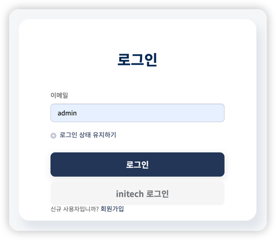
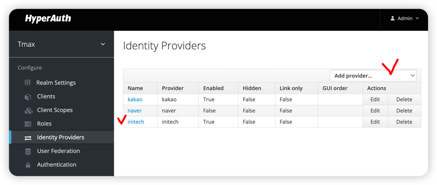
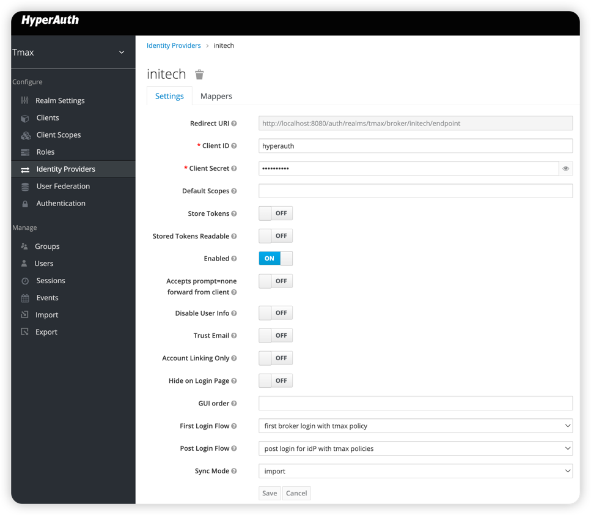
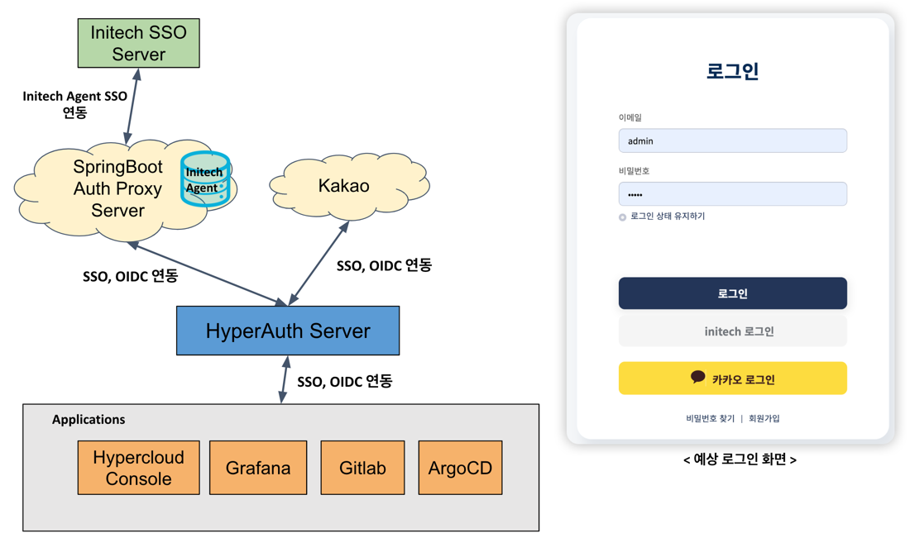
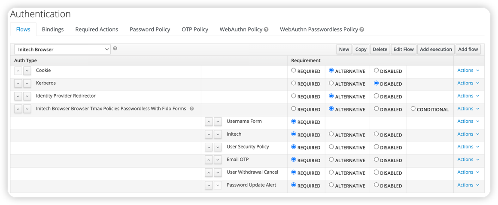

# External OIDC Provider
- ## 개요
  본 예제 프로젝트는 3가지의 인증 역할을 수행 할 수 있는 기능이 내장되어 있다. Springboot로 간단하게 구현.
  - 소셜로그인 기능
  - 2차인증 기능
  - 토큰 Claim 추가 호출용 기능
  
  ### 소셜로그인 기능
  - 카카오로 로그인, 네이버로 로그인 등과 같은 소셜로그인 기능에서 **카카오 및 네이버 역할을 할 수 있도록** 구현되어있다.
    - Oauth2 Code Grant flow 참고 
    - hyperauth(keycloak)이 구동 되어 있어야 한다. 
  - application.properties 참고 변수 설정
    - hyperauth url
    - realm 
  - ExternalAuthController
    - **OAuth2 Auth Endpoint** 역할
    - execution, scope, state, response_type,redirect_uri 를 Input으로 받아서 로그인 화면을 뿌려준다.
    - templates/externalAuth.html 참조
      - 
  - LoginController
    - 로그인 과정 진행
      - UserRepository에서 유저의 존재 여부만 판단하도록 구현
      - Hyperauth의 broker endpoint로 redirect
        - state, code 전달
          - 원래 code는 랜덤 Gen 해야하지만 내부적으로 로그인을 진행중인 유저의 이메일 정보를 옮기기 위해 사용하게 끔 구현
  - TokenController
    - **OAuth2 Token Endpoint** 역할
      - client secret 일치 여부 검사 (미구현)
      - token json 발급
        - 임시로 access_token 에 그냥 유저 이메일을 담음
  - UserController
    - **OAuth2 Profile Endpoint** 역할
      - 토큰을 통해 유저의 정보를 넘겨줌
  - Hyperauth 구현 예시
    - [코드 참조](https://github.com/tmax-cloud/hyperauth/tree/main/src/main/java/com/tmax/hyperauth/identity/initech)
    - 변경 필요 포인트
      - Provider ID, Name ....
      - Hyperauth에 등록된 본 프로젝트의 Auth, Token, User Endpoint URL
      - User Profile Json을 파싱하는 부분
  - Hyperauth 등록 예시
    -  
    - Identity Proivider 등록 (initech 으로 구현해놓음(예시))
      - 
    - initech Detail
      - 
      - client_id, client_secret은 아무거나 넣어놓은 상태
      - 어차피 본 프로젝트에서 발급한 값이라는 가정이고 현재 검증로직 추가 안함
  - Initech 연동 아키텍쳐
    - 
  
  ### 2차 인증
  - Hyperauth 로그인 화면에서 이메일(아이디) 만 입력한 후 인증을 Initech 화면에서 로그인을 거치면 최종 통과되도록 설계
    - Hyperauth의 Authentication 이랑 연관
    - ExternalAuthController
      - **외부 인증 로그인 화면**을 뿌려주는 역할
      - session_code, tab_id, client_id를 Input으로 받아서 로그인 화면을 뿌려준다.
      - templates/externalAuth.html 참조
    - LoginController
      - 로그인 과정 진행
      - session_code, tab_id, client_id, execution 을 Query parameter로 hyperuath의 login-actions/authenticate Endpoint로 Redirect 함으로써, Hyperauth에서 대기중인 Authentication Flow가 계속 진행되도록한다.
    - Hyperauth 등록 예시
      - Authentication Flow 수정
      - 
  
  ### 토큰 Claim 추가 호출용 기능
  - Hyperauth에서 특정 Client로 로그인시 토큰 Claim을 추가 발급하기 위해 외부 API를 호출하는 경우 사용
  - ClaimController 참고